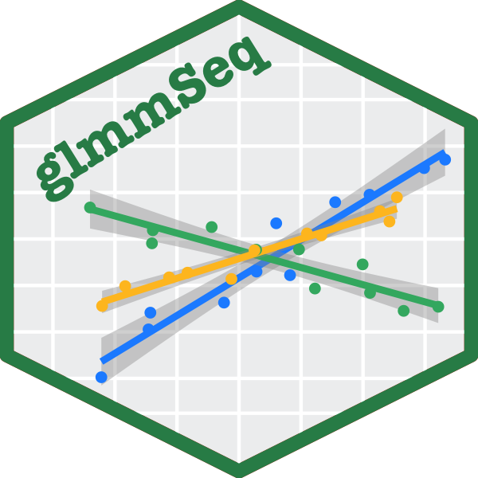

[](https://www.tidyverse.org/lifecycle/#experimental)
[](https://www.gnu.org/licenses/old-licenses/gpl-2.0.en.html)
[](https://cran.r-project.org/package=glmmSeq)
[](http://hits.dwyl.com/KatrionaGoldmann/glmmSeq)
[](https://GitHub.com/KatrionaGoldmann/glmmSeq/issues/)
[](https://GitHub.com/KatrionaGoldmann/glmmSeq/tags/)

# glmmSeq 


This R package is designed to model gene expression with a general linear mixed model (glmm). This allows us to include random effects as well as mixed effects. For the purpose of the package we use the `glmer` function from the [`lme4`](https://cran.r-project.org/web/packages/lme4/index.html)
package which fits a glmm.

This package focuses in particular on changes in genes expression between different response or treatment groups over time. 


## Package Structure

- ./R contains the scripts and functions
- ./data contains the minimal load/example data
- ./vignettes contains the package vignette/documentation (glmmSeq.html)


# Loading the package

### From Github

```
devtools::install_github("KatrionaGoldmann/glmmSeq", 
			auth_token = "57fa8679959c164aa8ecdd88860d6d1b7265313e")
```


### Locally

To load the package as a library you can run the code in ./package_creator then:

```
library(glmmSeq)
```

Else you can source the functions individually:

```
functions = list.files("./R", full.names = TRUE)
invisible(lapply(functions, source))
```

But you will need to load in the additional libraries then:

```
cranPackages <- c("MASS", "car", "ggplot2", 
                   "ggpubr", "lme4", "methods", 
                   "parallel", "plotly", "stats", 
                   "gghalves")
bioconductorPackages <- c("qvalue")
                   
# Install CRAN packages                   
invisible(lapply(cranPackages, function(p){
                   if(! p %in% rownames(installed.packages())) {
                     install.packages(p)
                   }
                   library(p, character.only=TRUE)
                 }))

# Install BioConductor packages
if (!requireNamespace("BiocManager", quietly = TRUE))
  install.packages("BiocManager")
invisible(lapply(bioconductorPackages, function(p) {
  if(! p %in% rownames(installed.packages())) { 
  BiocManager::install(p)
  }
  library(p, character.only=TRUE)
}))
```

# Example script

For examples see [Get started](https://katrionagoldmann.github.io/glmmSeq/articles/glmmSeq.html). 
